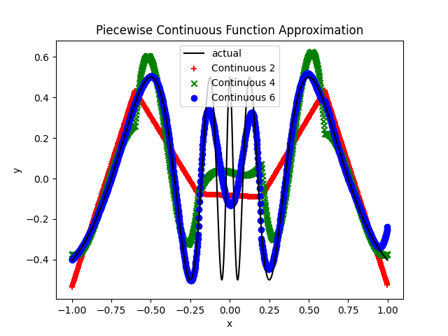
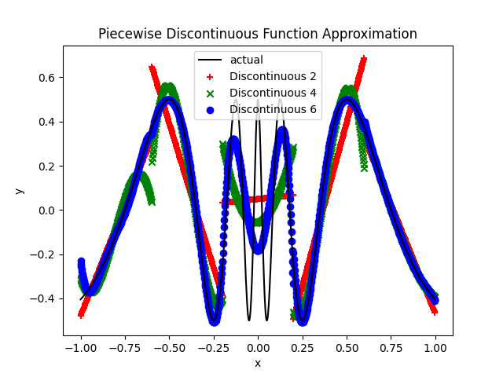
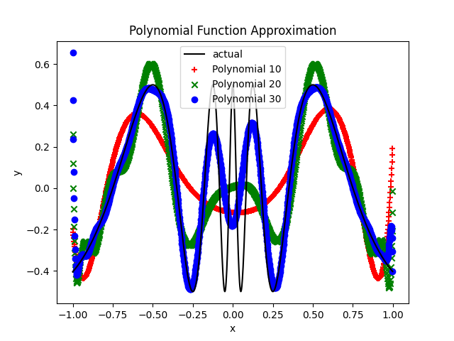
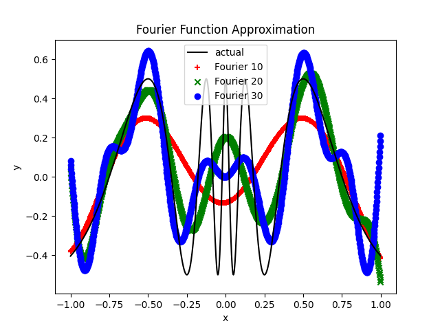
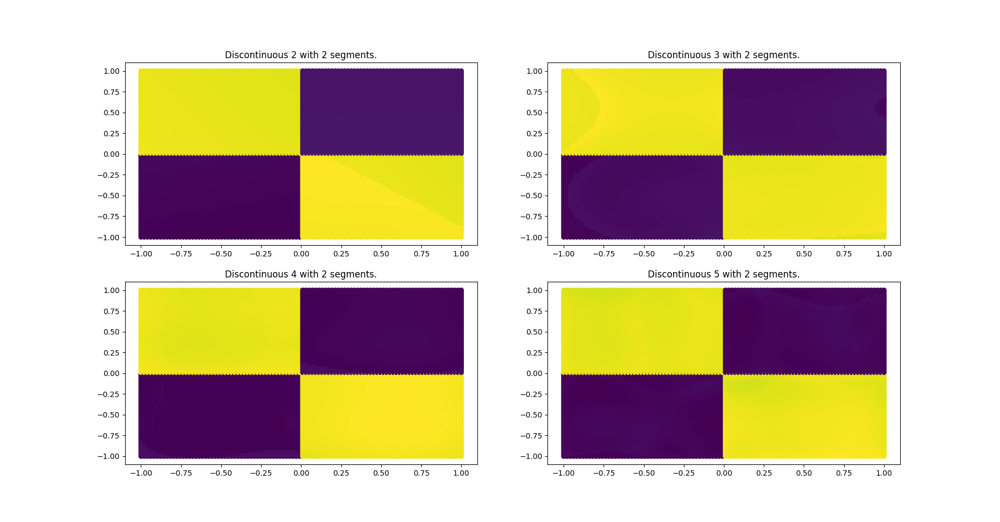
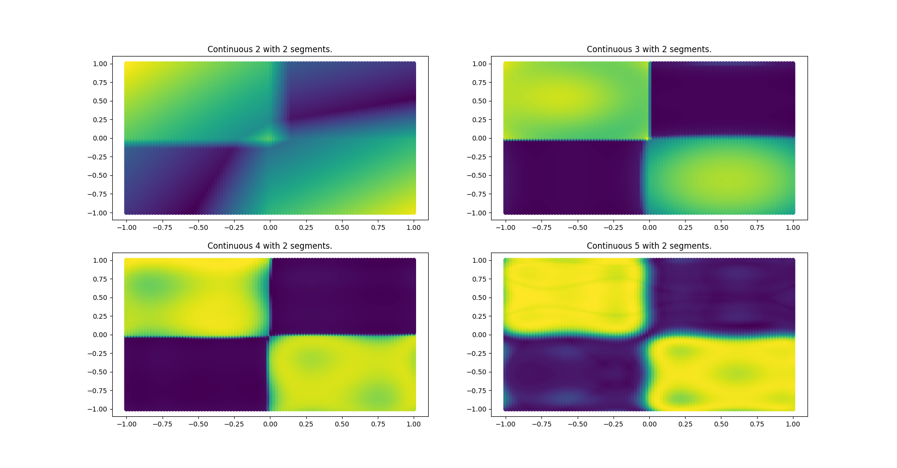
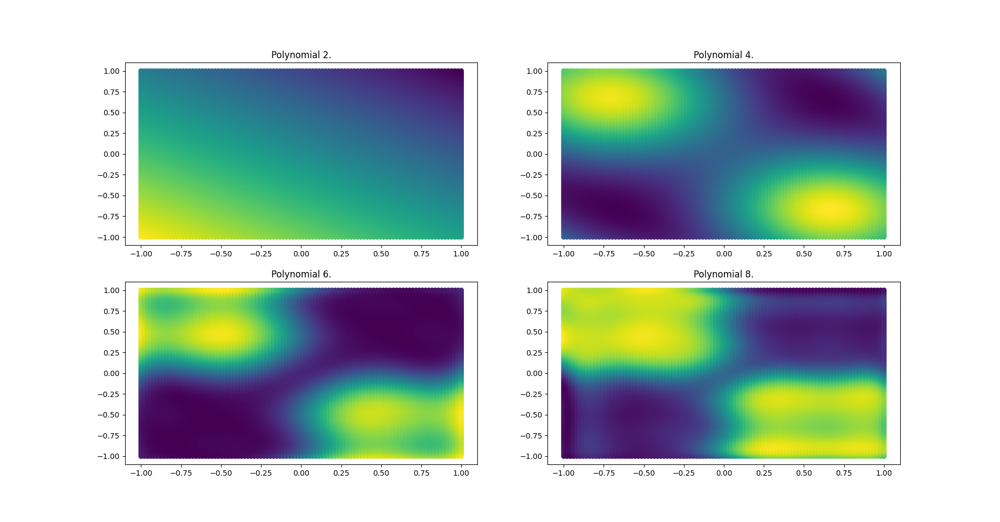
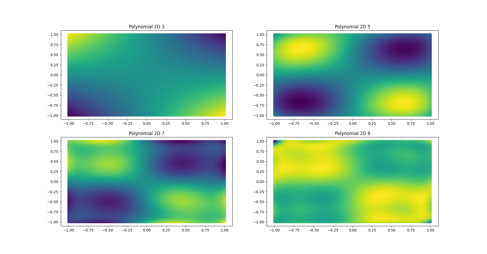

[](https://github.com/jloveric/high-order-layers-torch/actions/workflows/python-app.yml)


# Piecewise Polynomial Layers and Other High Order Layers in PyTorch

This is a PyTorch implementation of my tensorflow [repository](https://github.com/jloveric/high-order-layers) and is more complete due to the flexibility of PyTorch.

Lagrange Polynomial, Piecewise Lagrange Polynomial, Discontinuous Piecewise Lagrange Polynomial, Fourier Series, sum and product layers in PyTorch.  The sparsity of using piecewise polynomial layers means that by adding new segments the representational power of your network increases, but the time to complete a forward step remains constant. Implementation includes simple fully connected layers, convolution layers and deconvolutional layers using these models. This is a PyTorch implementation of this [Discontinuous Piecewise Polynomial Neural Networks](https://www.researchgate.net/publication/276923198_Discontinuous_Piecewise_Polynomial_Neural_Networks) which was written almost a decade before the recent interest in KAN's, including huge number of extensions including continuous, Fourier series and convolutional neural networks... and many applications with varrying degrees of success. If you
come from a computational physics background, this type of approach seems very obvious as ancient techniques like the finite element method are discretized
this way.

## Collab Notebook
Using simple high order layers
[Simple function approximation](https://colab.research.google.com/drive/1kew0Kz4v5GB5D59-wP1rHZuCdhYknz4s?usp=sharing)

Using simple high order MLP
[2d function approximation](https://colab.research.google.com/drive/14wSNzBUFYk-1o6fuqiux_y33aV9VuwkF?usp=sharing)


## Idea

The idea is extremely simple, instead of a weight at the synapse we have a function F(x) that can be arbitrarily complex. As a practical matter I implement this by using multiple weights corresponding to each link, these weight are used as parameters of the function, and to make sure there is still some GPU efficiency, these weights are just coefficients of the basis functions.  In most of this work, the n-weights describe the value of a piecewise polynomial on a regular grid (in the case of a piecewise polynomial) each of the n-weights can be updated independently. A Lagrange polynomial and Gauss Lobatto points are used to minimize oscillations of the polynomial.  The same approach can be applied to any "functional" synapse, and I also have Fourier series synapses in this repo as well. Because the non-linearity is applied on the link, the node is simply a summation

In the image below each "link" instead of being a single weight, is a function of both x and a set of weights.  These functions can consist of an orthogonal basis functions for efficient approximation.


A small layer then looks like this, the values at the nodes are just summed.


A single neuron input output pair with a piecewise function is shown below. In the case where we use polynomials, Lagrange polynomials are being used so the values of the weights are identical to the value of the function at that point. The spacing is determined by chebyshev lobatto points, so there are always weights at the edge of each segment. In the case of discontinuous polynomial, the weights there are 2 weights for each interior segment edge.


The image below shows the function passing through the weights when using lagrange polynomials. Note that there is no derivative continuity at the boundaries.


## Why

Using higher order polynomial representations allow networks with much fewer total weights in certain cases. There is a
well known phenomena in numerical modeling known as exponential convergence using spectral methods when using hp refinement,
it's possible something like that can happen in neural networks as well.

## Is this a KAN?

Actually a single layer piecewise polynomial KAN (which is actually 2 layers) is a special case of a 2 layer
piecewise polynomial network, which is used in this repo. Therefore, a piecewise polynomial layer is actually "Half a KAN" so
it's actually simpler - Often all you need is a single polynomial layer at the input followed by a standard MLP so
having the piecewise polynomial layer is important. Other names that have been used in the past Deep FLANN
(functional link artificial neural network).

Lagrange polynomials are widely used in finite element analysis and have the advantage that the value of the weight
is actually the value of the function at that point in space. By limiting the weights you are limiting the maximum
value of the function (the function may be higher than the weights in between the nodes). Also, when you go beyond the
range of definition [-1,1] the polynomial is still defined using the last (or first) polynomial in the sequence, whether you want it defined that way at high polynomial order is another question. I mention a paper at the bottom where they do a linear
extension beyond the range [-1,1] so values do not rise too fast - but normalization works as well.

## Issues

What about instabilities due to steep gradients? Seems like you can get around those with various approaches, polynomial
refinement is one (start with piecewise linear and than increase the polynomial order after it converges), the lion
optimizer helps a lot as well, while sophia may be even better since it's second order.

The biggest issues I've experienced though are that it's slower than dense networks and certain operations can
take up more memory which can cause major issues with models that already push the limits of your gpu. Now that
KANs are popular, hopefully there will be enough people to address all these issues.

In general, with enough effort, it seems I can make them "work" for any place the classic ReLU network works and
in certain situations they clearly work much better. They also do a great job of overfitting, which just means,
I need more data. For problems where your inputs are positional, x and y..., they seem to be far better.

Finally, I believe these methods actually will benefit much more from (approximate) second order optimizers. I used those in
my original implementation. Although there are plenty of second order optimizers out there, to date, pytorch does
not have a standard one except LBFGS which has its own issues.

## Fully Connected Layer Types
All polynomials are Lagrange polynomials with Chebyshev interpolation points.

A helper function is provided in selecting and switching between these layers

```python
from high_order_layers_torch.layers import *
layer1 = high_order_fc_layers(
    layer_type=layer_type,
    n=n,
    in_features=784,
    out_features=100,
    segments=segments,
)
```

where `layer_type` is one of
| layer_type          | representation
|--------------------|-------------------------|
|continuous         |  piecewise polynomial using sum at the neuron |
|continuous_prod    |  piecewise polynomial using products at the neuron |
|discontinuous      |  discontinuous piecewise polynomial with sum at the neuron|
|discontinuous_prod | discontinous piecewise polynomial with product at the neuron|
|polynomial | single polynomial (non piecewise) with sum at the neuron|
|polynomial_prod | single polynomial (non piecewise) with product at the neuron|
|product | Product |
|fourier | fourier series with sum at the neuron |


`n` is the number of interpolation points per segment for polynomials or the number of frequencies for fourier series, `segments` is the number of segments for piecewise polynomials, `alpha` is used in product layers and when set to 1 keeps the linear part of the product, when set to 0 it subtracts the linear part from the product.

## Convolutional Layer Types

```python
conv_layer = high_order_convolution_layers(layer_type=layer_type, n=n, in_channels=3, out_channels=6, kernel_size=5, segments=segments, rescale_output=rescale_output, periodicity=periodicity)
```

All polynomials are Lagrange polynomials with Chebyshev interpolation points.
| layer_type   | representation       |
|--------------|----------------------|
|continuous(1d,2d)   | piecewise continuous polynomial
|discontinuous(1d,2d) | piecewise discontinuous polynomial
|polynomial(1d,2d) | single polynomial
|fourier(1d,2d) | fourier series convolution

## Initializing of layers
The default initialization is to initialize each link to a random constant, i.e. all weights have the same value in a link. This seems to work
pretty well, however, I also have linear random linear initialization (non constant). The implementation of the linear initialization is slower and I'm not sure it's actually better.

 Here is a function that does this linear initialization for non convolutional layers (it can be found in [networks.py](https://github.com/jloveric/high-order-layers-torch/blob/master/high_order_layers_torch/networks.py))
```
def initialize_network_polynomial_layers(
    network: nn.Module,
    max_slope: float,
    max_offset: float,
    scale_slope: Callable[[float], float] = lambda input_size: 1,
)
```

## h and p refinement
p refinement is taking an existing network and increasing the polynomial order of that network without changing the network output.  This allow the user to train a network at low polynomial order and then use that same network to initialize a network with higher polynomial order.  This is particularly useful since a high order polynomial network will often converge poorly without the right initialization, the lower order network provides a good initial solution.  The function for changing the order of a network is
```
from high_order_layers_torch.networks import interpolate_high_order_mlp
interpolate_high_order_mlp(
    network_in: HighOrderMLP, network_out: HighOrderMLP
```
current implementation only works with high order MLPs, not with convnets.  A similar function exists for h refinement.  h refinement is
refining the number of segments in a layer, and is used for similar reasoning.  Layers with lots of segments may be slow to converge
so the user starts with a small number of segments (1 or 2) and then increases the number of segments (h) using the lower initialization.  The following function currently only works for high order MLPs, not with convnets
```
from high_order_layers_torch.network import hp_refine_high_order_mlp
hp_refine_high_order_mlp(
    network_in: HighOrderMLP, network_out: HighOrderMLP
)
```
# Installing

## Installing locally

This repo uses poetry, so run

```
poetry install
```

and then

```
poetry shell
```

## Installing from pypi

```bash
pip install high-order-layers-torch
```

or

```
poetry add high-order-layers-torch
```
# Examples

## Simple function approximation

Approximating a simple function using a single input and single output (single layer) with no hidden layers
to approximate a function using continuous and discontinuous piecewise polynomials (with 5 pieces) and simple
polynomials and fourier series.  The standard approach using ReLU is non competitive.  To see more complex see
the implicit representation page [here](https://github.com/jloveric/high-order-implicit-representation).






```python
python examples/function_example.py
```

## XOR : 0.5 for x*y > 0 else -0.5
```python
 python3 examples/xor.py
```

Simple XOR problem using the standard network structure (2 inputs 2 hidden 1 output) this will also work with no hidden layers. The function is discontinuous along the axis and we try and fit that function. Using piecewise discontinuous layers the model can match the function exactly.

With piecewise continuous.

With polynomial using similar number of parameters.

Using 2D polynomial "layer" this is just a single input and single output. The polynomial 2d is a link that takes in 2 variables (a 2d vector) and in this
case outputs a single value. It's the cartesian product of the basis function of a single polynomial function, but in the x and y direction. Using 5 point polynomials would have 25 basis functions in 2d whereas it has only 5 basis functions in 1d.
```
python3 examples/xor.py layer_type=polynomial_2d optimizer.lr=0.01 optimizer=sophia epochs=100
```

## MNIST (convolutional)

```python
python examples/mnist.py -m train_fraction=1 layer_type=polynomial2d,discontinuous2d,continuous2d n=2,3,4,5,6 segments=2 max_epochs=40 batch_size=1024 channels=[12,32] kernel_size=5 optimizer=sophia optimizer.lr=1e-3
```
Below using max_abs and sophia kernel_size=5, channels=[12,32]. The output layer was a standard linear
layer - so only the convolutions (2 of them) were high order. Nothing particularly interesting here, except
that instability doesn't seem to be an issue. I only ran each test once. 40 epochs batch size 1024. The case
of the polynomial where n=2 is actually linear, so I would expect about 0.89 score, but there is nonlinearity
through the normalization layer (and max pooling). Also note that in the linear case, every link has 2 weights.
| n   | test (polynomial)      | test (continuous) | test (discontinuous)
|--------------|----------------------|------------------|------------------|
|2 | 0.986 | 0.988 | 0.985
|3 | 0.987 | 0.989 | 0.989
|4 | 0.987 | 0.989 | 0.986
|5 | 0.987 | 0.988 | 0.987
|6 | 0.989 | 0.986 | 0.984

reduce the size of the network, same as above but channels=[3,8]
| n   | test (polynomial)      | test (continuous) | test (discontinuous)
|--------------|----------------------|------------------|------------------|
|2 | 0.969 | 0.977 | 0.980
|3 | 0.978 | 0.983 | 0.983
|4 | 0.984 | 0.983 | 0.984
|5 | 0.983 | 0.984 | 0.983
|6 | 0.981 | 0.982 | 0.982

Creating a deeper network with 4 convolutions and max_abs normalization between layers, 2 segments, avg pooling after each pair
of convolutions
```
python examples/mnist.py -m train_fraction=1 layer_type=discontinuous2d polynomial2d,continuous2d n=2,3,4,5,6 segments=2 max_epochs=100 batch_size=1024 channels=[16,32] output_layer_type=auto double=True kernel_size=3 optimizer=sophia optimizer.lr=1e-3
```
| n   | test (polynomial)      | test (continuous) | test (discontinuous)
|--------------|----------------------|------------------|------------------|
|2 | 0.927 | 0.990 | 0.989
|3 | 0.989 | 0.989 | 0.988
|4 | 0.989 | 0.989 | 0.990
|5 | 0.990 | 0.988 | 0.989
|6 | 0.987 | 0.985 | 0.990
|7 | 0.989 |     |
|8 | 0.989 |     |
|9 | 0.988 |     |
|10| 0.989 |     |

Reduced the learning rate on sophia by a factor of 10, run up to a 9th order polynomial
```
python examples/mnist.py -m train_fraction=1 layer_type=polynomial2d n=2,3,4,5,6,7,8,9,10 segments=2 max_epochs=100 batch_size=1024 channels=[16,32] output_layer_type=auto double=True kernel_size=3 normalization=max_abs optimizer=sophia optimizer.lr=1e-4
```
| n   | test (polynomial)
|--------------|----------------------|
|2 | 0.910 |
|3 | 0.985 |
|4 | 0.988 |
|5 | 0.989 |
|6 | 0.988 |
|7 | 0.990 |
|8 | 0.991 |
|9 | 0.991 |
|10| 0.989 |

Only Using 2 convolutions and lion optimizer
```
python examples/mnist.py -m train_fraction=1 layer_type=polynomial2d n=2,3,4,5,6,7,8,9,10 segments=2 max_epochs=100 batch_size=1024 channels=[16,32] output_layer_type=auto,linear double=False kernel_size=5 normalization=max_abs optimizer=lion optimizer.lr=1e-4
```
The results below are the same problem, but one has a polynomial last layer (auto) and the other has a linear last layer.
The polynomial last layer is the same as that used in the convolution.

| n   | polynomial polynomial| polynomial linear|
|--------------|----------------------|---------------|
|2 | 0.928 | 0.930
|3 | 0.984 | 0.984
|4 | 0.991 | 0.990
|5 | 0.989 | 0.990
|6 | 0.990 | 0.990
|7 | 0.989 | 0.989
|8 | 0.989 | 0.989
|9 | 0.990 | 0.989
|10| 0.990 | 0.990

## MNIST Block 3D polynomial / block piecewise polynomial
Basics implemented, needs to be made more efficient and model needs to change a bit. Currently uses a single NxNxN polynomial
with 3 inputs (grayscale color, x, y) and 10 outputs to solve mnist. Not performant, but will work on it.
```
python3 examples/block_mnist.py accelerator='cuda' batch_size=64 optimizer.lr=1e-3
```
and
```
python examples/block_mnist.py optimizer=lion optimizer.lr=1e-3 batch_size=16 max_epochs=100 n=28 layer_type=polynomial_3d
```
and then for block piecewise polynomial
```
python examples/block_mnist.py optimizer=lion optimizer.lr=1e-3 batch_size=16 max_epochs=100 n=3 segments=10 layer_type=continuous_nd
```
## CIFAR100 (convolutional)

```
python examples/cifar100.py -m max_epochs=20 train_fraction=1.0 layer_type=polynomial segments=2 n=7 nonlinearity=False rescale_output=False periodicity=2.0 lr=0.001 linear_output=False
```
## Autoencoder (haven't finished implementing)

```
python examples/autoencoder.py -m max_epochs=300 train_fraction=1.0
```

## Variational Autoencoder
Still a WIP.  Does work, but needs improvement.
```
python examples/variational_autoencoder.py -m max_epochs=300 train_fraction=1.0
```
run with nevergrad for parameter tuning
```
python examples/variational_autoencoder.py -m
```

## Invariant MNIST (fully connected)
Some comparisons using parameter scans maxabs normalization as default. piecewise polynomial cases use 2 segments. I only
did one run each.
```
python3 examples/invariant_mnist.py -m mlp.n=2,3,4,5,6 mlp.hidden.width=128 mlp.layer_type=polynomial optimizer=sophia
```
to run all the examples in the table
```
./scripts/invariant_mnist.sh
```
All the following results are a single hidden layer of 128 units. I only ran
one test case each, but it looks like sophia is the best optimizer. Layernorm
is best until you get to higher order and then max_abs is better, most likely
because it does a better job of keeping in [-1,1]. I'll try and get the higher
orders to where I think they can be. Also, all of these memorize the training set.

Below using max_abs and sophia
| n   | test (polynomial)      | test (continuous) | test (discontinuous)
|--------------|----------------------|------------------|------------------|
|2 | 0.950 | 0.974 | 0.973
|3 | 0.979 | 0.970 | 0.963
|4 | 0.971 | 0.970 | 0.961
|5 | 0.965 | 0.960 | 0.964
|6 | 0.967 | 0.963 | 0.960

Using layernorm and sophia
| n   | test (polynomial)      | test (continuous) | test (discontinuous)
|--------------|----------------------|------------------|------------------|
|2 | 0.959| 0.979 | 0.972
|3 | 0.977 | 0.974 | 0.969
|4 | 0.971 | 0.962 | 0.965
|5 | 0.966 | 0.954 | 0.953
|6 | 0.951 | 0.946 | 0.947

Using layernorm and lion
| n   | test (polynomial)      | test (continuous) | test (discontinuous)
|--------------|----------------------|------------------|------------------|
|2 | 0.948| 0.977 | 0.975
|3 | 0.979 | 0.970 | 0.967
|4 | 0.972 | 0.968 | 0.965
|5 | 0.966 | 0.955 | 0.955
|6 | 0.960 | 0.949 | 0.949

Using max_abs and lion
| n   | test (polynomial)      | test (continuous) | test (discontinuous)
|--------------|----------------------|------------------|------------------|
|2 | 0.113 | 0.970 | 0.970
|3 | 0.972 | 0.971 | 0.963
|4 | 0.966 | 0.962 | 0.966
|5 | 0.966 | 0.960 | 0.964
|6 | 0.962 | 0.953 | 0.960

Without polynomial refinement
```python
python examples/invariant_mnist.py max_epochs=100 train_fraction=1 mlp.layer_type=continuous mlp.n=5 mlp.p_refine=False mlp.hidden.layers=4
```
with polynomial refinement (p-refinement)
```
python examples/invariant_mnist.py max_epochs=100 train_fraction=1 layer_type=mlp.continuous mlp.n=2 mlp.target_n=5 mlp.p_refine=True
```
I've also added hp refinement, but it needs a lot of testing.

## Implicit Representation

An example of implicit representation for image compression, language generation can be found [here](https://github.com/jloveric/high-order-implicit-representation).  I intend to explore generative models in natural language further [here](https://github.com/jloveric/language-interpolation)

## PDEs in Fluid Dynamics

An example using implicit representation to solve hyperbolic (nonlinear) wave equations can be found [here](https://github.com/jloveric/neural-network-pdes)

## Natural Language Generation

Examples using these networks for natural language generation can be found
[here](https://github.com/jloveric/language-interpolation)

## Generative music

No real progress here
[here](https://github.com/jloveric/high-order-generative-music)


## Test and Coverage

After installing and running
```
poetry shell
```
run
```
pytest
```
for coverage, run
```
coverage run -m pytest
```
and then
```
coverage report
```
## A note on the product unit (I rarely use anymore)
The layers used here do not require additional activation functions and use a simple sum or product in place of the activation.
I almost always use sum units, but product units are performed in this manner

$$ product=-1+\prod_{i}(1 + f_{i})+(1-\alpha)\sum_{i}f_{i} $$

The 1 is added to each function output to as each of the sub products is also computed.  The linear part is controlled by
the alpha parameter.

## Notes on optimizer
The Lion or Sophia optimizers seems to be the best choice since it performs better than Adam in general, but seems to work especially well
for the case of polynomials.

## Notes on normalization
Although you can use batchnorm, layernorm etc... work better, I've found that you can actually just use the infinity norm ("max_abs" norm) which has no parameters
for this formulation (same approach seems not to work very well for standard relu networks - but need to investigate this further).
The max_abs normalization is defined this way
```
normalized_x = x/(max(abs(x))+eps)
```
where the normalization is done per sample (as opposed to per batch).  The way the layers are formulated, we don't want the neuron
values to extend beyond [-1, 1] as the polynomial values grow rapidly beyond that range.  You can also use mirror periodicity to keep the
values within from growing rapidly. We want the values to cover the entire range [-1, 1] of the polynomials as the weights
are packed towards the edges of each segment (though using even number of segments means you'll have a lot of weights near the origin).


## Reference
You can refer to this repo here
```
@misc{Loverich2020,
  author = {Loverich, John},
  title = {High Order Layers Torch},
  year = {2020},
  publisher = {GitHub},
  journal = {GitHub repository},
  howpublished = {\url{https://github.com/jloveric/high-order-layers-torch}},
}
```
and there is an old paper which was originally written in c++ and doesn't cover
nearly as much as this repo and all the dependent repos, which you can also refer
to
```
@article{loverich2015discontinuous,
  title={Discontinuous Piecewise Polynomial Neural Networks},
  author={Loverich, John},
  journal={arXiv preprint arXiv:1505.04211},
  year={2015}
}
```
## Notes

[KAN: Kolmogorov–Arnold Networks 2024](https://arxiv.org/pdf/2404.19756) was published (9 years after the original implementation of the technique in this repo), where B-splines were used on the grid. Looking at that repo, the real difference seems to be B-splines vs lagrange
polynomials.

[Variations on the Chebyshev-Lagrange Activation Function](https://arxiv.org/abs/1906.10064) implements a linear extension
to the values beyond [-1,1] which would solve the problem of polynomial growth outside that range.

[KAN: Kolmogorov–Arnold Networks: A review 2024](https://vikasdhiman.info/reviews/KAN_a_review.pdf) A review of KANs with respect to other types of networks, especially spline networks

[Linear spline networks 2020](https://arxiv.org/pdf/2001.06263)

[Learning Activation Functions in Deep (Spline) Neural Networks 2020](https://ieeexplore.ieee.org/stamp/stamp.jsp?arnumber=9264754) using B splines
